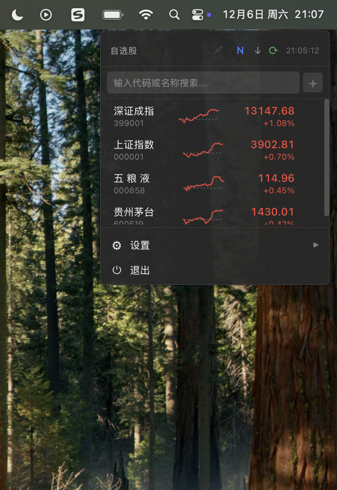

# Millionaire

> 梦想还是要有的，万一实现了呢？

一款专为牛马设计的桌面端股票监控应用。小巧隐蔽，一键呼出，神不知鬼不觉地关注你的自选股。失去焦点自动隐藏，让你在工位上也能安心做个「隐形股民」。

支持 macOS / Windows / Linux。

## 打工人专属

- **极致隐蔽** - 菜单栏驻留，无 Dock 图标，失焦即隐，老板路过无痕迹
- **一键呼出** - 快捷键秒开秒关，比 Alt+Tab 还快
- **摸鱼友好** - 仅交易时段自动刷新，下班后不打扰你的生活
- **迷你精致** - 小窗口大信息，分时走势一目了然



## 功能特性

- **自选股管理** - 添加、删除、拖拽排序
- **实时行情** - A股实时价格和涨跌幅
- **分时走势** - 迷你分时图展示当日走势
- **智能刷新** - 仅在交易时段（9:30-11:30, 13:00-15:00）自动刷新
- **窗口置顶** - 需要时可固定窗口
- **自定义快捷键** - 打造专属摸鱼手势

## 快捷键

- `⌥M` (Option + M) - 显示/隐藏面板（可自定义）

## macOS 用户须知

由于应用未经 Apple 签名，首次打开时可能会提示"已损坏"或"无法打开"。请在终端执行：

```bash
xattr -cr /Applications/Millionaire.app
```

如果快捷键无法使用，需要在「系统设置 → 隐私与安全性 → 辅助功能」中添加 Millionaire 并授权。

## 开发

### 环境要求

- Node.js 18+
- Rust 1.77+
- macOS 10.15+

### 安装依赖

```bash
npm install
```

### 开发模式

```bash
npm run tauri dev
```

### 构建应用

```bash
npm run tauri build
```

## 技术栈

- **前端**: React + TypeScript + Vite
- **后端**: Tauri 2 + Rust
- **数据源**: 东方财富 API

## 配置文件

配置文件位于 `~/Library/Application Support/com.millionaire.stock/config.json`，包含：

- 快捷键设置
- 窗口尺寸

## License

MIT
